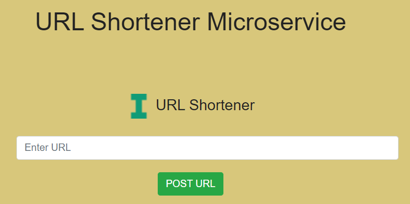
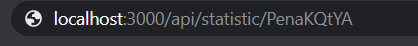
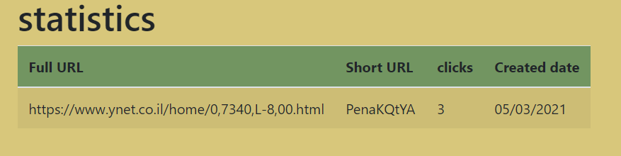
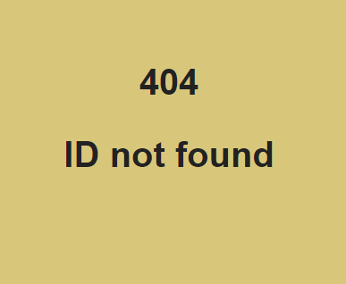

# URL shortner 📎

## On the project

- in this app you can take URL and make it shorter, and use it.

- Can watch the statistic of specific URL address:
                                                  - The original URL address
                                                  - The short URL 
                                                  - The time the short URL created
                                                  - The number of clicks on the short URL

- If you got an error when you used the app, the app announces what the error.

- There are tests that check that everything is working as required

## link to repl.it

- https://shortener-url-final-3.idoleybo.repl.co

